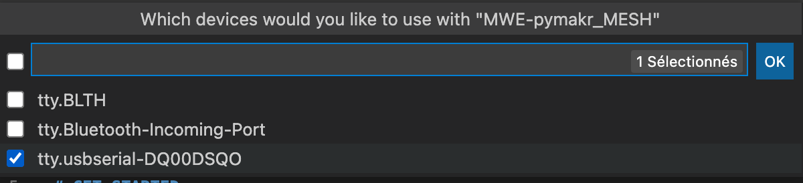

# WHAT

Minimum Working Example fro the LoPy Board from pycom connected on the ExpansionBoard v2.1.

# GET STARTED

To get started follow the https://docs.pycom.io/gettingstarted/ link.

Once you have install Pymakr extension for vscode (haven't tried in Atom), in order to write some python code directly to the board.

## Interact with the board through python
* If you haven't done it yet, go to the pymakr main tab  and create a project by hitting the + in the PROJECT pane 
* Passing the mouse over the project name shows up 'Select device' option 
* Click on the button and select your device in the list that appears 
* Pass over the listed serial device in your project  and hit the first icon 
* It opens up a micro python terminal directly connected to the board and on which you can copy/paste the code in step 3 of the previsou link :
```
>>> import pycom
>>> pycom.heartbeat(False)
>>> pycom.rgbled(0x330033)
```


## Send a script to the board (vscode)

The "run on device feature" in vscode is reachable by the triple dots at the top right of vscode (pymakr > run on device). If troubles appear, close vscode, relaunch and run again.

# MAKE BLE MESH EXAMPLE WORK

In order to use Bluetooth Mesh examples (https://docs.pycom.io/tutorials/networkprotocols/blemesh/), one need `pymesh` firmware in order to access to commands like `network.Bluetooth.BLE_Mesh`.
Follow the instructions displayed here : https://docs.pycom.io/updatefirmware/device/.
Use of pymesh here : https://youtu.be/4dgxvkZbF_4
Need of LoPy4 min.

# TROUBLESHOOTING
## LoPy's LED stay red
If the LoPy's LED turns red right after being pluged in and doesn't change its color, try putting a wire between G23 and GND, click on the reset button and remove the wire. 
(src : tudro's answer on https://forum.pycom.io/topic/1343/solved-lopy-bricked-red-led thread)